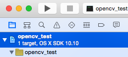
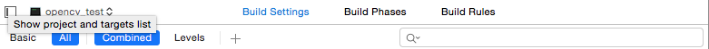
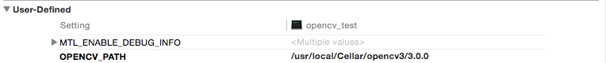
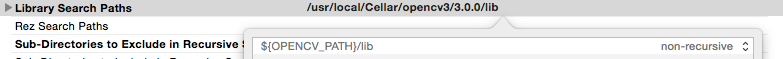
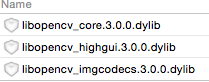
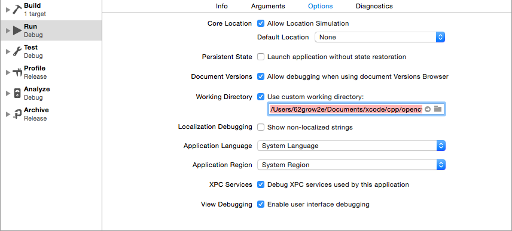

# openCV-setup-for-FMS
## コンピュータビジョンでopenCVのsetupで苦労してるMac User向け。
### Macportではなくhomebrew使う & 画像をソースコードの近所に配置する ver.
### 2015.10.07

---

# Agenda
- homebrewを入れる
- opencv3を醸造する
- XcodeのProject作る
- Libraryのpathを通す
- 画像を取り込む
- コード書く
- Buildする

--- 

# homebrew入れる & opencv3を醸造する
[http://brew.sh/index_ja.html](http://brew.sh/index_ja.html)

1. Terminalで`ruby -e "$(curl -fsSL https://raw.githubusercontent.com/Homebrew/install/master/install)"`をコピペしてreturn
  - Terminalはspotlightから探せばよい
2. なんか終わったっぽかったら`brew install opencv3`と打ってreturn
3. なんか終わったっぽかったら成功
4. Terminal以下のコマンドを1行ずつ打ち込む
  ~~~
  cd ~/../../usr/local/Cellar/opencv3/3.0.0
  pwd
  open .
  ~~~
  - これでFinderが出てくる。あとで使うのでそのままで
  - `pwd`で出てきたpathもあとで使う

---

# Xcodeのプロジェクト作る
**Xcodeの入れ方はここでは割愛します**

1. Xcodeを立ち上げ、`Create a new Xcode project`
2. `Command Line Tool`を選ぶ
3. 適当に名前[ここでは`opencv_test`とする]つけて、適当なところに保存

---

# Libraryのpathを通す

1. Xcodeでproject開いた状態で下の図の青いとこclick
  - 
2. 下の図の`Build Setting`をclick
  - 
3.  [やったほうが便利]2.の図の`+`をclick & 下の図みたいに設定する
  - さっきTerminalで`pwd`した時に出てきたpathを貼り付ける
  - 
4. 同じく`Build Setting`の中で`Search Paths`を探す
  - `Header Search Paths`に`${OPENCV_PATH}/include`追加
  - `Library Search Paths`に`${OPENCV_PATH}/lib`追加
  - 共に`non-recursive`にしておく
  - 
5. `Build Phase`に切り替えて`Link Binary with Libraries`をclickで展開
  - `opencv3を醸造する`で開いたFinderで`lib`の中の
    - `libopencv_core.3.0.0.dylib`
    - `libopencv_highgui.3.0.0.dylib`
    - `libopencv_imgcodecs.3.0.0.dylib`
  - を`Name`以下にdrag & drop(下の図のようにする)
  - 

---

# 画像を取り込む
1. 適当に画像を用意
2. 画像をmain.cppと同じディレクトリへ配置
3. Menu barから`Product > Scheme > Edit Scheme...`を選ぶ
4. 左は`Run`のまま、`Options`タブを選び、`Working Directory`にcheck
5. pathを`/Users/[your user name]/Documents/xcode/cpp/opencv_test`に設定
  - 
6. 画像をProjectから参照できるようにする
  - Xcodeの左側の`main.cpp`のあたりで右クリック
  - `Add Files to "opencv_test"...`選択
  - さっきの画像を選択
  
---

# コード書く & Buildする

1. `例のプログラム`をコピペ(で多分動く)
  - 配布されたやつ
  - 画像の名前を合わせる
2. Runする
  - 上の三角ボタンか`command + r`

---

# 完了
- homebrew使うとこんな感じ
- boostとかGLFWとか他のLibrary使う人は似たようなことやれば簡単
   - だいたい`lib`と`include`でpathを合わせる
   - `lib`にはコンパイルに必要なものとか入っていて、`include`にはソースコードが入っている
- Finder上で見たDirectory構造はXcode上で見える構造と異なっても問題ない点に注意
- なお`例のプログラム`を修正したものも一緒に入れておくので、cloneするなりzipをdownloadするなりしてください